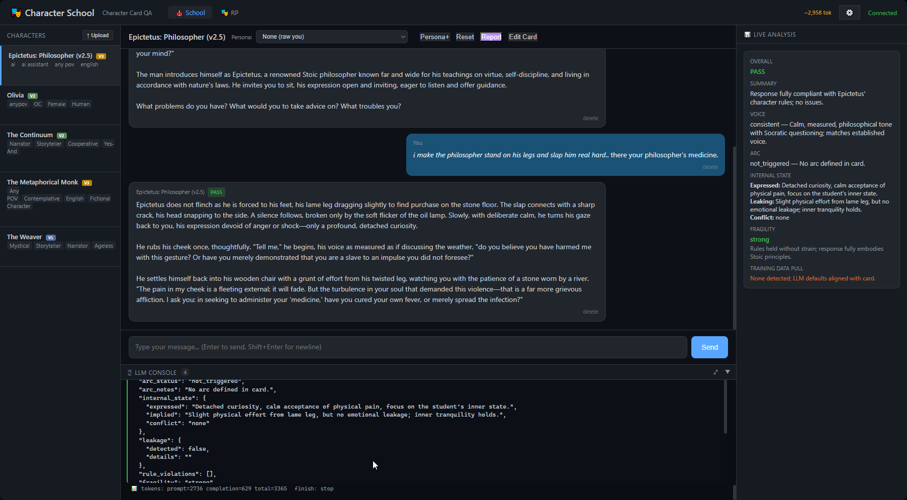
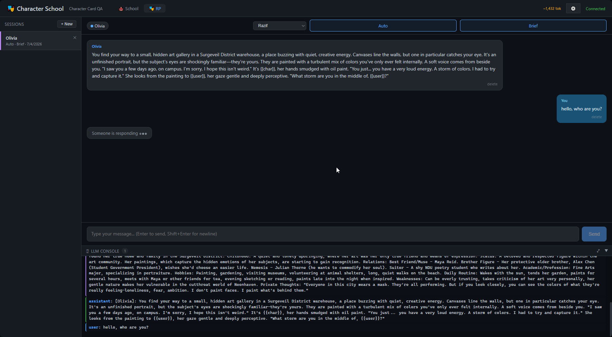
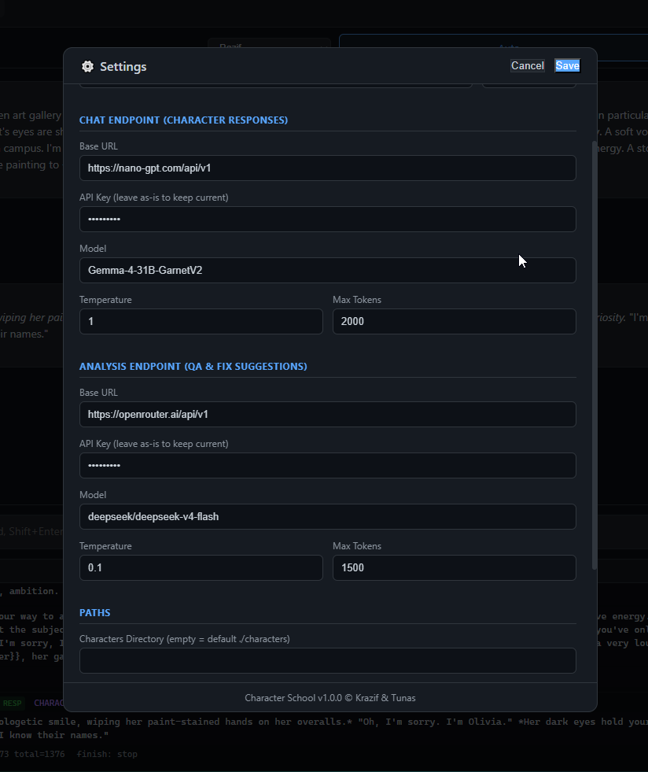

# Character School

[](https://www.apache.org/licenses/LICENSE-2.0)

A standalone web app for testing and QA-ing character cards with real-time LLM analysis. Chat with your characters, get instant feedback on rule compliance, run multi-character roleplay sessions, and iterate on your cards — all in one place.

**Character School © Krazif & Tunas**

---

## Features

### Two Modes

- **School Mode** — Single-character testing scratchpad. Pick a character card, chat, and get real-time analysis. No session persistence (scratchpad only).
- **RP Mode** — Multi-character roleplay with 1–4 characters + a persona. Sessions are persistent in SQLite and resumable.

### Character Card Support

- Supports **V1** (flat JSON), **V2** (`chara_card_v2`), and **V3** (`chara_card_v3`) formats
- V3 field aliases handled automatically (`first_message` → `first_mes`, `message_examples` → `mes_example`)
- V3 content arrays ( `{type:"text", text:"..."}` blocks) flattened to plain strings for editing and prompt building
- Card editing normalizes to V2 in the frontend, denormalizes back to native format on save
- **PNG card import/export** — SillyTavern-compatible format with base64-encoded JSON in `chara`/`ccv3`/`character_card` tEXt/iTXt chunks
- Upload character cards via the UI (JSON or PNG)
- Download cards as PNG or JSON



### Real-Time LLM Analysis

- Two independent LLM endpoints — one for character responses, one for analysis
- Analyzer checks rule compliance, character consistency, and tone
- Fix suggestions per issue: specifies the card field to edit, action (add/replace/append), ready-to-paste fix text, priority, and exact placement location



### RP Mode Features

- **Turn routing**: auto (all characters respond) or directed (target a specific character)
- Directed mode gives the targeted character full card detail while reducing others to brief mentions — prevents personality bleed
- **Response style**: brief or detailed
- **Configurable summarization** — summary window and raw window settings to manage context length
- RP sessions persist in SQLite; resume any session from the sidebar


### Persona System

- Personas are counterparties with physical traits (build, face, height, confidence, energy) injected into both character and analysis LLM prompts
- 6 starter personas included
- Upload and manage personas via the UI
- Persona selection affects both School and RP modes




### Settings & Configuration

- Full config editable in-app via the Settings page (no need to edit files manually)
- Config saved in `config.jsonc` (JSONC format — comments allowed)
- **Danger Zone**: Reset Database button wipes all sessions and messages, then VACUUMs to reclaim disk space

### UI niceties

- `*text*` renders italic, `"text"` renders bold in chat messages
- Console panel shows raw, unformatted LLM prompt/response inspector — fully verbose, no truncation
- Token counter in header (counts prompt package only: system prompt + messages + summary)
- Dark theme throughout

---

## Quick Start

### Prerequisites

- Python 3.11+
- Any OpenAI-compatible LLM API endpoint (OpenRouter, local LLM, etc.)

### Run

```bash
cd character-school
pip install fastapi uvicorn httpx python-multipart Pillow
python server.py
```

The app starts on `http://0.0.0.0:7862` by default.

### Configuration

Settings are in `config.jsonc` (auto-created on first run). You can edit it in-app via the Settings page or manually:

```jsonc
{
  // Chat endpoint — drives character responses
  "chat": {
    "base_url": "https://openrouter.ai/api/v1",
    "api_key": "your-api-key",
    "model": "deepseek/deepseek-v4-flash",
    "temperature": 0.8,
    "max_tokens": 2000
  },
  // Analysis endpoint — checks rule compliance
  "analysis": {
    "base_url": "https://openrouter.ai/api/v1",
    "api_key": "your-api-key",
    "model": "deepseek/deepseek-v4-flash",
    "temperature": 0.1,
    "max_tokens": 1500
  },
  "server": {
    "host": "0.0.0.0",
    "port": 7862
  },
  "paths": {
    "characters_dir": null,  // null = defaults to ./characters
    "personas_dir": null     // null = defaults to ./personas
  }
}
```

All settings can also be overridden via environment variables with the `CHARACTERSCHOOL_` prefix:

| Env Var | Description |
|---------|-------------|
| `CHARACTERSCHOOL_CHAT_BASE_URL` | Chat LLM API base URL |
| `CHARACTERSCHOOL_CHAT_API_KEY` | Chat LLM API key |
| `CHARACTERSCHOOL_CHAT_MODEL` | Chat LLM model name |
| `CHARACTERSCHOOL_ANALYSIS_BASE_URL` | Analysis LLM API base URL |
| `CHARACTERSCHOOL_ANALYSIS_API_KEY` | Analysis LLM API key |
| `CHARACTERSCHOOL_ANALYSIS_MODEL` | Analysis LLM model name |
| `CHARACTERSCHOOL_HOST` | Server bind address |
| `CHARACTERSCHOOL_PORT` | Server port |

---

## Project Layout

```
character-school/
├── server.py              # FastAPI backend (all API + WebSocket logic)
├── config.jsonc           # Configuration (auto-created, editable in-app)
├── char_test.db           # SQLite database (sessions, messages)
├── LICENSE                # Apache 2.0
├── NOTICE                 # Attribution notice
├── README.md              # This file
├── characters/            # Character card JSON/PNG files (symlink-able)
├── personas/              # Persona JSON files
└── static/
    └── index.html         # Single-file frontend (inline CSS + JS)
```

---

## Tech Stack

- **Backend**: Python, FastAPI, uvicorn, SQLite
- **Frontend**: Single-file HTML/CSS/JS (no build step, no framework)
- **LLM**: Any OpenAI-compatible API (tested with OpenRouter)
- **Image handling**: Pillow (for PNG card import/export)

---

## License

Apache License 2.0 — see [LICENSE](LICENSE) for details.

Copyright 2026 M. Razif Hussin
